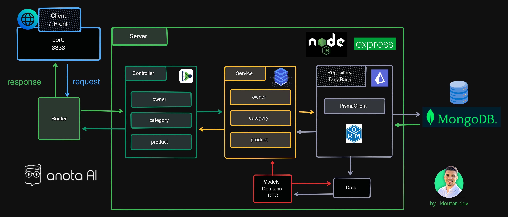

# 🟢 Projeto Desafio Fullstack ANOTAI

## 📗 Descrição
Bem-vindo ao Projeto Desafio Fullstack ANOTAI! Este projeto inclui tanto o backend robusto quanto o frontend responsivo, transformando a maneira como você gerencia usuários, categorias e produtos. 🌟

## 🛠️ Instalação
Para instalar e configurar este projeto fullstack, siga os passos de instalação contidos nos README's das respectivas pastas:

### Backend
1. Navegue até a pasta `backend`:
    - [BACKEND](./backend)

### Frontend
1. Navegue até a pasta `frontend`:
    - [FRONTEND](./frontend)

### Siga as instruções do README para instalar as dependências e configurar o servidor.

## 🚀 Recursos
- **Backend**: Node.js, Express, MongoDB, JWT, Prisma ORM.
- **Frontend**: React, TypeScript, Tailwind CSS, React Router DOM, Axios.

Aproveite e transforme a sua experiência de gerenciamento com o Anotai!

# 👤 Author

| [ Kleuton Novais](https://github.com/kleutons) |
| :---------------------------------------------------------------------------------------------------------------------------------------: |
|                                            [Linkedin](https://www.linkedin.com/in/kleuton-novais/)        