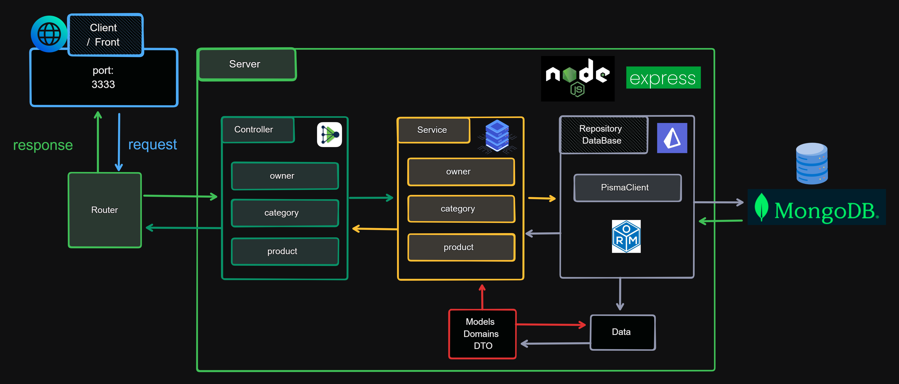

# 🟢 Projeto Desafio Backend com Node.js e Express ANOTAI


## 📗 Descrição
Este é um projeto de backend desenvolvido com Node.jse Express. Ele permite o cadastro de categorias e produtos, oferecendo funcionalidades de CRUD (Create, Read, Update, Delete) para cada um deles.

# 🔥 Desafio
Este projeto faz parte do desafio [GitHub Anotai - New Test Backend Node.js](https://github.com/githubanotaai/new-test-backend-nodejs).

O desafio consiste em desenvolver uma API para um sistema de gerenciamento de catálogo de produtos em uma aplicação de marketplace, com base nas seguintes histórias de usuário:
- Como usuário, quero cadastrar um produto com seu proprietário, para que eu possa acessar seus dados no futuro (título, descrição, preço, categoria, ID do proprietário).
- Como usuário, quero cadastrar uma categoria com seu proprietário, para que eu possa acessar seus dados no futuro (título, descrição, ID do proprietário)
- Como usuário, quero associar um produto a uma categoria.
- Como usuário, quero atualizar os dados de um produto ou categoria.
- Como usuário, quero deletar um produto ou categoria do meu catálogo.
- Um produto pode estar associado apenas a uma categoria por vez.
- Produtos e categorias pertencem apenas a um proprietário.
- Gere o JSON do catálogo e publique-o para chache.

Diagrama representando a estrutura final do projeto:


# 🧩 Arquitetura em Camandas 
 - `routes`
 - `controllers`
 - `services`
 - `repositories` (Prisma ORM)
 - `data` (cache)
 - `models` 

# 🚀 Tecnologias Utilizadas
- Node.js
- Express
- MongoDB
- Prisma (ORM)
  
# ⚙️ Funcionalidades
## 👤 Usuários
 - Listagem de Usuários
 - Cadastro de Usuário
 - Atualização de Usuário
 - Remoção de Usuário
## 🗂️ Categorias
 - Listagem de Categorias
 - Cadastro de Categoria
 - Atualização de Categoria
 - Remoção de Categoria
## 📦 Produtos
 - Listagem de Produtos
 - Cadastro de Produto
 - Atualização de Produto
 - Remoção de Produto


# 🛠️ Instalação
Clone este repositório
```
    git clone https://github.com/kleutons/node-fullstack-anotaai
```
Navegue até a pasta backend
```
    cd ./backend
```
Instale as dependências
```
    npm install
```
Configure as variáveis de ambiente
- Crie um arquivo .env na raiz do projeto backend
- Adicione as variáveis de ambiente necessárias: (ex: PORT para definir a porta, DB_URI para a conexão com o banco de dados)
  - `PORT=3333`
  - `DATABASE_URL="mongodb+srv://xxx"`

Configure o Prisma
```
npx prisma init
```
Inicie o servidor
```
    npm run dev
```

# 🌐 Endpoints
## 👤 Usuários
- GET api/category - Lista todas os usuários
- POST api/category - Cria um novo usuário
- PUT api/category/:id - Atualiza um usuário pelo ID
- DELETE api/category/:id - Remove um usuário pelo ID
## 🗂️ Categorias
- GET api/category - Lista todas as categorias
- POST api/category - Cria uma nova categoria
- PUT api/category/:id - Atualiza uma categoria pelo ID
- DELETE api/category/:id - Remove uma categoria pelo ID

## 📦 Produtos
- GET api/product - Lista todos os produtos
- POST api/product - Cria um novo produto
- PUT api/product/:id - Atualiza um produto pelo ID
- DELETE api/product/:id - Remove um produto pelo ID

# 👥 Desafio
- Este projeto faz parte do desafio [GitHub Anotai - New Test Backend Node.js](https://github.com/githubanotaai/new-test-backend-nodejs).

# 👤 Author

| [<br><sub>Kleuton Novais</sub>](https://github.com/kleutons) |
| :---------------------------------------------------------------------------------------------------------------------------------------: |
|                                            [Linkedin](https://www.linkedin.com/in/kleuton-novais/)                                             |