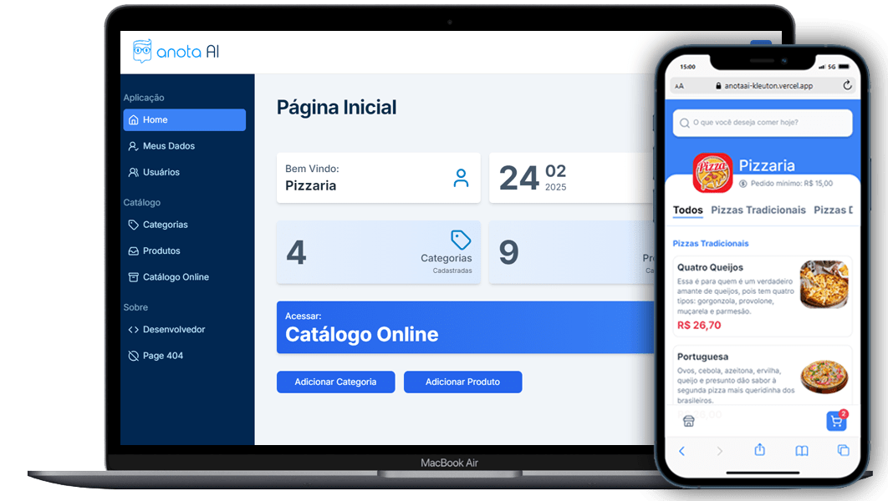

# 🟢 Projeto Desafio FrontEnd ANOTAI


## 📗 Descrição
Bem-vindo ao projeto frontend para o AnotaAi! Este projeto foi desenvolvido com React e TypeScript, projetado para revolucionar a forma como você gerencia usuários, categorias e produtos. ✨
<br/>
A aplicação é completamente responsiva, com estilização impecável usando Tailwind CSS, navegação fluida com React Router DOM e integração com APIs através do Axios.
<br/>
### Recursos Principais:
- **Catálogo de Produtos:** Produtos organizados por categorias para fácil navegação.
- **Sistema de Busca:** Encontre produtos rapidamente com a busca integrada.
- **Carrinho de Compras e Checkout:** Experiência de compra simplificada e eficiente.
- **Autenticação e Login:** Rotas de acesso protegido ao sistema com JWT (JSON Web Token). 🚀
<br/>

Esse sistema é alimentado pelo poderoso CRUD (Create, Read, Update, Delete) do backend formanto um projeto totalmente Fullstack, garantindo que você tenha controle total sobre seus dados. 🔄
<br/>
Pronto para transformar sua experiência de gerenciamento? Vamos nessa!

# 🛠️ Instalação
Clone este repositório
```
    git clone https://github.com/kleutons/node-fullstack-anotaai
```
Navegue até a pasta frontend
```
    cd ./frontend
```
Instale as dependências
```
    npm install
```
Configure as variáveis de ambiente
- Crie um arquivo .env na raiz do projeto backend
- Adicione as variáveis de ambiente necessárias: (ex: VITE_API_URL definir a url da api do backend)
  ```env
    VITE_API_URL=http://localhost:3333/api
  ```
Inicie o servidor
```
    npm run dev
```


# 👤 Author

| [<br><sub>Kleuton Novais</sub>](https://github.com/kleutons) |
| :---------------------------------------------------------------------------------------------------------------------------------------: |
|                                            [Linkedin](https://www.linkedin.com/in/kleuton-novais/)        